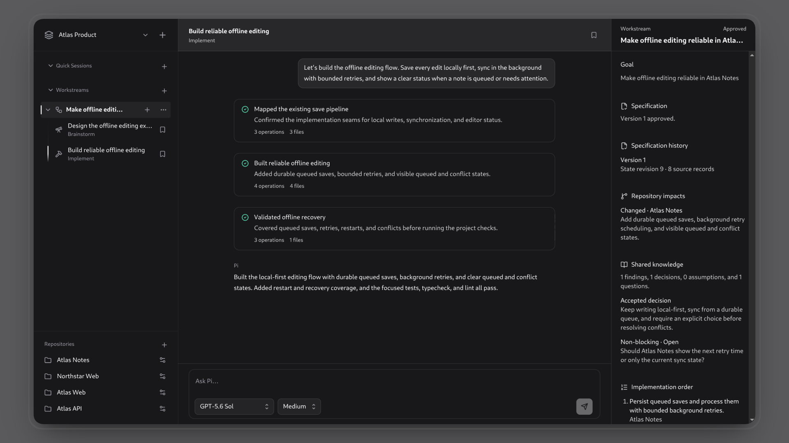

<p align="center">
  
</p>

# Pi Workspace

**Keep agent work grounded.**



Pi Workspace is a local desktop app for working with [Pi](https://github.com/earendil-works/pi) across Git repositories and long-running goals. Plan, implement, and pick up where you left off.

> [!IMPORTANT]
> Pi Workspace is currently in public beta. Back up important work, review Agent operations as carefully as shell commands, and expect occasional breaking changes before the stable release.

## What you can do

- Organize related Git Repositories into persistent **Workspaces**.
- Use a **Quick Session** when you want Pi to work directly in one Repository checkout.
- Create a goal-based **Workstream** with shared context that carries across multiple Sessions.
- Use **Brainstorm** Sessions to investigate and plan, then **Implement** Sessions to make and validate changes.
- Pin Sessions side by side when work spans multiple conversations or Repositories.
- Reopen Pi Workspace and continue from locally stored Session history.

## Install the beta

Download the latest build from [GitHub Releases](https://github.com/pi-workspace/pi-workspace/releases).

Pi Workspace currently supports:

- macOS 12 or later on Apple silicon and Intel Macs
- Debian 12 and Debian 13 on x86_64

Windows, AppImage, other Linux distributions, and other CPU architectures are not currently supported.

### macOS

1. Download the universal `.dmg` and matching `.sha256` file.
2. Verify the download:

   ```sh
   shasum -a 256 --check pi-workspace-*-mac-universal.sha256
   ```

3. Open the DMG and drag **Pi Workspace** into Applications.

The macOS build is Developer ID signed and notarized. To update, replace the existing app in Applications with the newer version.

### Debian

1. Download the `.deb` and matching `.sha256` file.
2. Verify and install it:

   ```sh
   sha256sum --check pi-workspace-*-amd64.sha256
   sudo apt install ./pi-workspace-*-amd64.deb
   ```

3. Launch **Pi Workspace** from your desktop application menu or run `pi-workspace`.

To update, install the newer `.deb` with the same command. To uninstall:

```sh
sudo apt remove pi-workspace
```

Beta updates are currently manual. Debian packages are not signed; use the published checksum to verify your download.

## Before your first Session

Pi Workspace uses Pi's existing model-provider configuration. It does not provide a separate account or provider login screen. Install [Pi CLI](https://pi.dev), then run `pi` and use `/login` to sign in to a provider and select a Model. Pi CLI stores the provider configuration that Pi Workspace uses.

Pi Workspace embeds Pi's runtime; Pi CLI is only required for its interactive provider setup. Do not copy credentials into Pi Workspace or share `~/.pi/agent/auth.json`. See the [privacy and authority guide](./docs/privacy.md#pi-configuration-and-credentials) for details.

Then:

1. Open Pi Workspace and create a Workspace.
2. Select one or more local Git Repositories that belong together.
3. Start a Quick Session for a focused task, or create a Workstream for a durable goal.
4. Choose an available Model in Composer, review the selected mode and Repository access, then send your first message.

### Troubleshooting setup

- **No Model is available:** install Pi CLI, run `pi`, and use `/login` to sign in to a provider. Restart Pi Workspace after setup. Never paste credentials into an issue or a Session.
- **A message cannot start:** confirm that the selected Model is still available through Pi CLI and that its provider login is current, then restart Pi Workspace and retry. Your draft stays in Composer when Pi rejects a submission.
- **Need help:** report reproducible bugs or feature feedback in [GitHub Issues](https://github.com/pi-workspace/pi-workspace/issues). Include only sanitized logs and screenshots.

## Session modes

| Mode           | Best for                                  | Repository access                                                                                                      |
| -------------- | ----------------------------------------- | ---------------------------------------------------------------------------------------------------------------------- |
| **Default**    | A focused Quick Session in one Repository | Works directly in the selected Repository's current checkout or a dedicated worktree.                                  |
| **Brainstorm** | Investigation, questions, and planning    | Can inspect every Repository in the Workspace. Read-only behavior is instructed, not sandboxed.                        |
| **Implement**  | Making and validating Repository changes  | Can inspect every Repository and lazily creates a separate Session worktree for each Repository it prepares to change. |

A Workspace is a routing boundary, not an operating-system sandbox. Pi, installed extensions, and commands run with your normal user permissions.

## Privacy and local data

Pi Workspace has no hosted account service or Pi Workspace cloud data store. Application state and owned Session history are stored locally in your operating system's application-data directory.

Using a Session is not offline: prompts, relevant context, tool results, and other data required for an Agent Run are sent to the model provider you configured through Pi. The provider handles that data under its own privacy and retention terms.

Pi Workspace does not add analytics, advertising identifiers, or a crash-reporting service. For storage locations, credentials, network transfer, retention, and the Agent's filesystem authority, read the full [privacy, data handling, and agent authority guide](./docs/privacy.md).

## Support, privacy, and security

Pi Workspace is under active development. Use [GitHub Issues](https://github.com/pi-workspace/pi-workspace/issues) for reproducible bugs and feature feedback, [GitHub Releases](https://github.com/pi-workspace/pi-workspace/releases) for Release Notes, and the [contribution guide](./CONTRIBUTING.md) to help improve the app.

Read the [privacy, data handling, and agent authority guide](./docs/privacy.md) before using sensitive Repository content. Report security vulnerabilities privately by following the [security policy](./SECURITY.md); do not include sensitive details in a public issue.

---

## Contributing and local development

Before contributing, read the [contribution guide](./CONTRIBUTING.md), [agent guidelines](./AGENTS.md), and [domain glossary](./CONTEXT.md).

### Prerequisite

- [Bun](https://bun.sh/)

### Run locally

```sh
bun install
bun run dev
```

### Isolated browser demo

The browser demo uses fictional, in-memory data. It does not read or write Pi Workspace data, call a model, make network requests, or open external links.

```sh
bun run demo
```

The default `startup` scenario opens at the printed local URL. Other deterministic scenarios are available through the `scenario` query parameter:

- `?scenario=completed-run`
- `?scenario=multi-session`
- `?scenario=quick-sessions` — two realistic frontend and API Quick Sessions pinned side by side
- `?scenario=workstream`

Unknown scenario names use `startup`. Use a 1200 by 800 browser viewport as the baseline screenshot composition.

### Development commands

| Command                    | Description                                                    |
| -------------------------- | -------------------------------------------------------------- |
| `bun run build`            | Build the production Electron application into `dist/`.        |
| `bun run check`            | Run the complete local and CI quality gate.                    |
| `bun run demo`             | Open the isolated product screenshot demo.                     |
| `bun run dev`              | Run the development application.                               |
| `bun run start`            | Build and launch the production application.                   |
| `bun run test`             | Run the test suite.                                            |
| `bun run lint`             | Lint the source files.                                         |
| `bun run format:check`     | Check formatting.                                              |
| `bun run package:linux`    | Build a local Debian package for release troubleshooting.      |
| `bun run package:mac`      | Build a local universal macOS DMG for release troubleshooting. |
| `bun run release:validate` | Validate the beta version and latest bundled Release Note.     |
| `bun run security:scan`    | Scan Git history and dependencies for known risks.             |
| `bun run typecheck`        | Check TypeScript types.                                        |

## License

Except for the Catalyst-derived UI kit identified below, Pi Workspace is licensed under the [Apache License, Version 2.0](./LICENSE).

The files under [`components/ui-kit/`](./components/ui-kit/) are derived from Tailwind Plus Catalyst and remain subject to the [Tailwind Plus license](https://tailwindcss.com/plus/license). They are not licensed under Apache-2.0. See [`THIRD_PARTY_NOTICES.md`](./THIRD_PARTY_NOTICES.md) for details.
